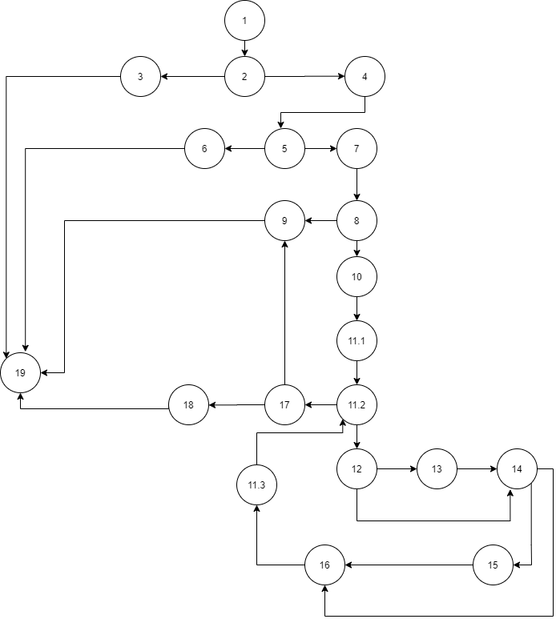

# Втора лабораториска вежба по Софтверско инженерство

## Теодора Кочова, бр. на индекс 186119

### Група на код:

Ја добив групата на код 2

### Control Flow Graph
Графот е прикажан на сликата подолу. Направен е во draw.io. Јазлите се означени со броеви кои соодветно припаѓаат на некоја линија од кодот.

### Цикломатска комплексност

Цикломатската комплексност може да се пресмета:
а) Преку бројот на региони има 7 региони плус 1 за целиот од надвор 8. 
б) Преку формулата E-V+2, каде Е е бројот на ребра, а V e бројот на темиња 
   27-21+2=8
в) Преку предикатни јазли, таму каде што има разгранување со формулата P+1, каде P e бројот на предикатни јазли имаме 7 предиканти јазли 7+1=8

Па цикломатската комплексност е 8.

### Тест случаи според критериумот Every branch

Со Every branch критериумот се вклучуваат сите ребра од едно теме до друго во рамките на графот. За овој код што го добив за функцијата function доволни беа 5 тест случани за да се поминат сите ребра во графот.

1. User=null allUsers=anything
2. User=[Tea,pass,teakocova@gmail.com] allUsers=user
3. User=[Tea,0000,null] allUsers=[Filip,2222,filip@yahoo.com] 
4. User=[Tea,0000,tk@gmail.com]  allUsers=[Filip,2222,filip@yahoo.com]
5. User=[Tea,0000,gmail.com] allUsers=[Filip,2222,filip@yahoo.com]

### Тест случаи според критериумот Multiple conditions

Co Multiple conditions критериумот се разработуваат оние деловите од кодот каде што постои разганување со if и притоа содржи еден или повеќе логички оператори. Во функцијата function има 3 вакви if-услови. Во продолжение се дадени тест случаите за секој од нив.

### Објаснување на напишаните unit tests

Unit тестовите кои се искуцани во SILab2Test се напишани според тест случаите добиени од претходно објаснетите два критериуми. Со everyBranch имаме 5 тест случаи, а со multipleConditions имаме 8 проверки. За сите тест случаеви кодот успешно работеше. 

